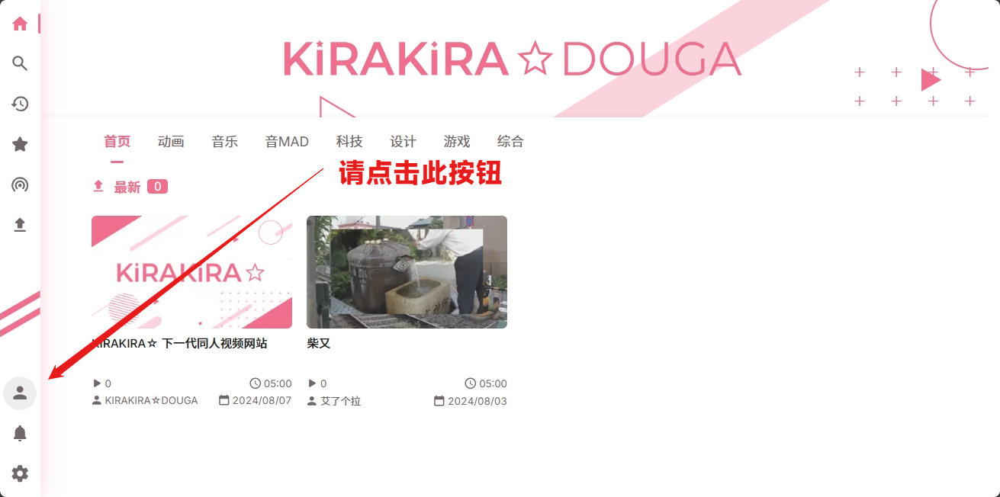
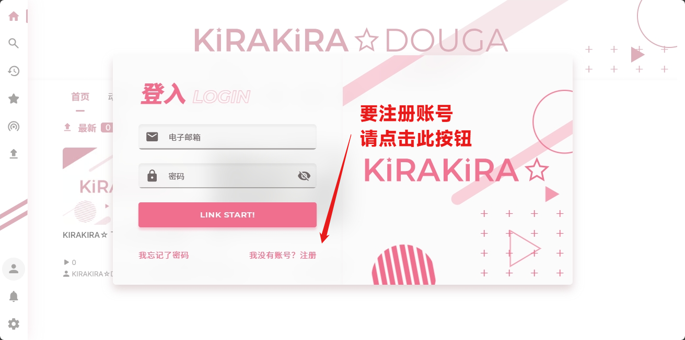
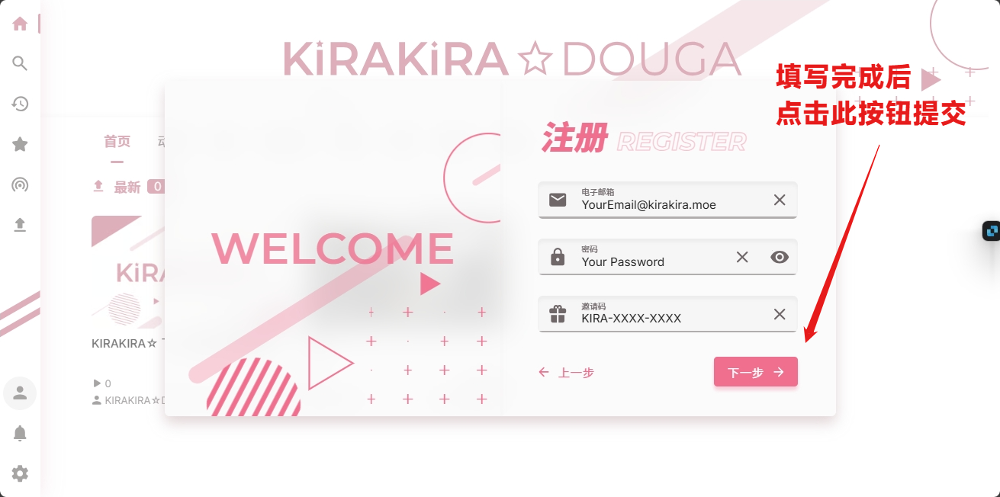

# 用户注册

> 由于 KiraKira☆Douga 的注册用户数已经突破了500名，为了更好地维护服务质量，**官方决定<del>暂时</del>停止邀请码的发放**。\
> 现在，新用户在注册7天后即可生成新的邀请码并邀请其他用户加入。感谢您的理解与支持。\
> 若你还未注册，请等待已注册7日以上的老用户的邀请。

## 注册流程

### 第一步 · 打开网页

在浏览器中输入 `https://kirakira.moe` 打开 KiraKira☆Douga 的主页（以下简称 KiraKira）。\
或者您可以点击 [KiraKira☆Douga](https://kirakira.moe/) 以直接打开。

### 第二步 · 点击注册

在主页左侧，您会看到 KiraKira 的导航栏。\
点击导航栏中的头像图标以打开 `登入` 窗口。\
在 登入 窗口的右下角，点击 `我没有账号？注册` 按钮，开始创建您的 KiraKira 账号。

### 第三步 · 填写信息

在注册窗口中，您需要填写以下信息：

- 用户名：您的用户名，用于登录 KiraKira。\
  用户名需要满足以下条件：
  - 用户名必须为1~20个字符
  - 可包含数字、大小写拉丁字母、越南语字母、汉字、常用平/片假名、现代谚文音节、特殊符号 ( 连字符 `-` 与 下划线 `_` )。
  - 用户名不允许重名。
  - 不可包含以上未提到的其他特殊字符。
- 昵称：您的昵称，用于显示在您的主页及其他需要您名称的地方。
  - 昵称的创建规则与用户名一致
  - 昵称可以重复

点击下一步后，你需要继续填写以下信息：

- 邮箱：您的登录邮箱，用于注册 KiraKira。
  - 一个邮箱只能注册一个 KiraKira 账号。
- 密码：您的密码，用于登录 KiraKira。
  - 请不要设置过于简单的密码。
- 邀请码：填入你获得的邀请码。

### 第四步 · 注册成功

接下来，请您按照屏幕上的指示完成注册流程。
一旦您完成这些步骤，您的账号注册即告完成。
