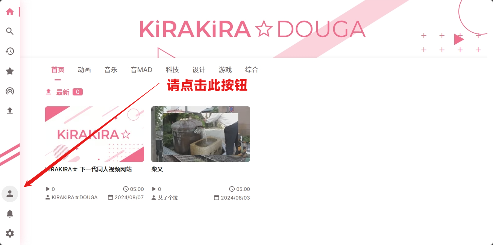
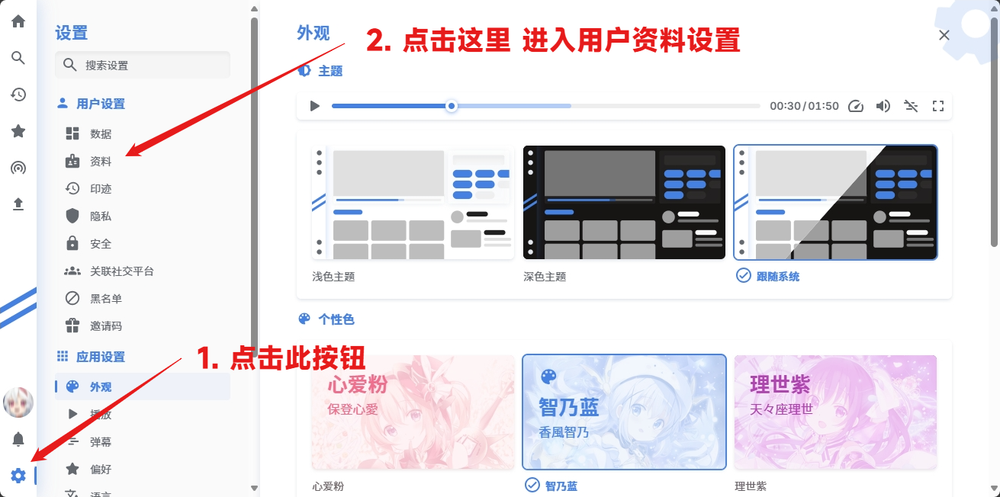
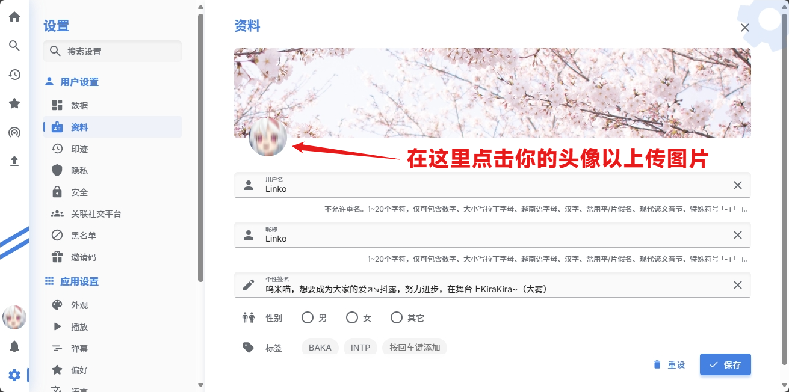
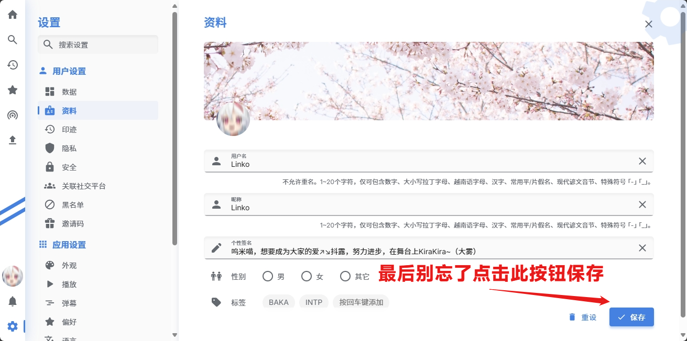

# 更改头像

## 更改流程

### 第一步 · 打开网页

在浏览器中输入 `https://kirakira.moe` 打开 KIRAKIRA☆DOUGA 的主页（以下简称 KiraKira）。\
或者您可以点击 [KIRAKIRA☆DOUGA](https://kirakira.moe/) 以直接打开。
打开主页后，请你登录自己的账号。



### 第二步 · 进入设置

然后，点击画面左下角（导航栏最下方）的 `设置` 按钮。
进入设置后，点击位于边栏中上的 `用户设置` - `资料` 。



### 第三步 · 更改头像

点击头像，选择你想要上传的头像。

```{todo}
:class: warning

部分设备（大部分手机浏览器）打开该页面时可能不显示头像。\
如果您遇到这种情况，可以尝试使用 Edge、Chrome、FireFox 等主流浏览器；\
或是使用支持的浏览器的 `桌面模式`（或 `查看桌面模式` 等）尝试。

```

<script>
    document.querySelector("#id6 > p.admonition-title").innerText = "警告"
</script>



### 第四步 · 确认更改

点击屏幕右下角的 `保存` 按钮，完成头像的更改。

```{todo}
:class: tip

你也可以再此改变你账户的昵称、标签或是性别。

```

<script>
    document.querySelector("#id8 > p.admonition-title").innerText = "提示"
</script>



### 第五步 · 修改成功

最后，你可以返回主页（点击屏幕左侧导航栏最上面的 `主页` 按钮）以继续浏览。
